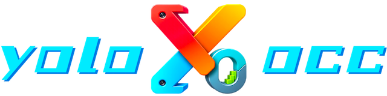
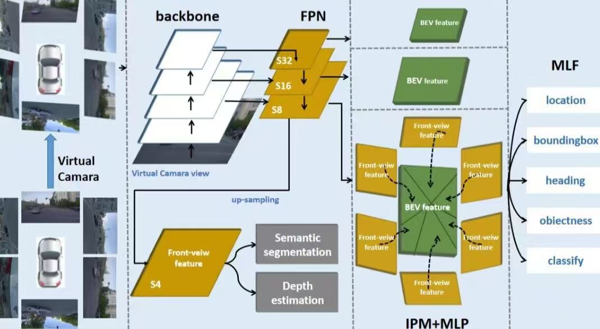
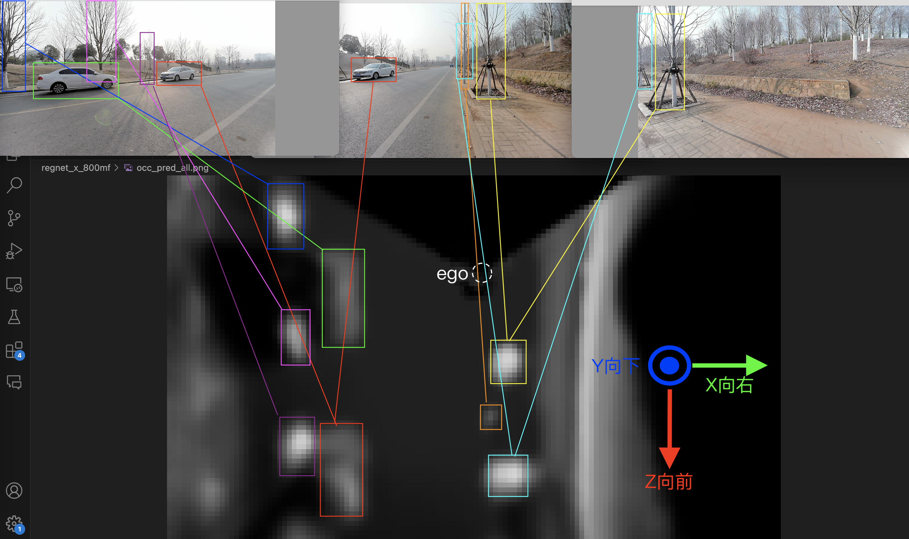

<div align="center"></div>

## Introduction
YOLOXOCC is a 3D detection framework for occupancy networks implemented based on the [YOLOXE](https://github.com/Megvii-BaseDetection/YOLOX) series of 2D detectors. It draws inspiration from [LSS](https://github.com/nv-tlabs/lift-splat-shoot) and [SimpleBEV](https://github.com/aharley/simple_bev).

- **Objectives:**
  - Achieve real-time performance on mainstream embedded NPU platforms like RK3588 when using three camera inputs.
  - Enable training with mixed data from different collection devices.
  - Export trained models with camera parameters to adapt to platforms with different camera configurations without retraining.

- **Basic Approach:**
  - Input multi-front-view images.
  - Extract features into multiple scales.
  - Transform and merge these features onto multiple height-based BEV maps using scaled camera intrinsic and extrinsic parameters.
  - Output grid occupancy maps and BEV object detection results at different scales.


Thanks to my wife for this abstract image (this image reflects the model status as of March 2024, which only implemented layered BEV object detection without occupancy maps; the depth and semantic segmentation auxiliary heads in the front-view were later removed due to high data acquisition costs).

* **Techniques:**
  - Avoid traditional augmentations (mirroring, affine transformations) during feature extraction due to camera parameter constraints; instead, apply these augmentations on BEV feature maps within the same batch. (please refer to the `yoloxocc.models.transformer.bev_augment` for details).
  - Convert front-view features to BEV by directly using camera parameters, merging non-zero areas of projected features, averaging overlaps. (please refer to the `yoloxocc.models.transformer.perspective_trans` for details).
  - Added remapping method for efficiency on NPUs where gridsample is unavailable or inefficient; this increases model size but ensures compatibility and efficiency under certain conditions. (please refer to the `yoloxocc.utils.vox` for details).
  - Use pseudo-temporal data for temporal feature enhancement by randomly perturbing current frame BEV features as previous frame input. (please refer to the `yoloxocc.models.temporal` for details).
  - Directly downsample LiDAR point clouds into voxels as targets, using CenterNet/Keypoints/Dice loss methods.
  - Adopt YOLOXE's approach for object detection, labeling, training, and validation on BEVs. This project does not provide these; if needed, you can add them by following the YOLOXE example.
  - Design auxiliary heads similar to YOLOXE for both OCC and 2D detection.
  - Implement UncertaintyLoss similarly to YOLOXE for managing multiple tasks.
  - Export outputs by writing JSON and exp files according to required camera parameters, see examples in 'exps/output'.

## Quick Start

<details>
<summary>Installation</summary>

```shell
pip3 install -r requirements.txt
```

</details>

<details>
<summary>Demo</summary>

```shell
python3 tools/yoloxocc_infer.py --onnx 20250222_yoloxocc_regnet_x_400mf_w16x2x12_v64x4x48_best52.24_images_remapping.onnx --model regnet_x_400mf --test 1 --images
```

</details>

<details>
<summary>How to use</summary>

Step1. Prepare dataset

Organize the dataset in the following format. (please refer to the `datasets` for details).
sequence dict file format:
```json
{
    "000000": [
        "single.json",
        ...
    ],
    ...
}
```
single dict file format:
```json
{
    "token": "0000-0000-0000-0000",
    "next": "0000-0000-0000-0001",
    "prev": null,
    "lidars": {
        "top": {
            "path": "20241121/lidars/top/1732154776500.ply",
            "instances": [
                {
                    "location": [0, 1, 2],
                    "rotation": 3,
                    "dimensions": [4, 5, 6],
                    "category": "car"
                },
                {
                    "location": [4, 5, 6],
                    "rotation": 7,
                    "dimensions": [8, 9, 10],
                    "category": "pedestrian"
                }
            ],
            "extrinsics": [0, 1, 0, 0, 0, 0, 1, -1355, 1, 0, 0, 0]
        }
    },
    "cameras":{
        "front": {
            "path": "20241121/cameras/front/1732154776703.jpg",
            "width": 1280,
            "height": 720,
            "instances": [
                {
                    "bbox": [1, 2, 3, 4],
                    "category": "car"
                }
            ],
            "distortion": [-3.910e-03, -3.638e-02, 2.603e-03, -1.265e-03, 1.115e-02],
            "intrinsics": [4.960e+02, 4.957e+02, 6.142e+02, 3.151e+02],
            "extrinsics": [1, 0, 0, 0, 0, 1, 0, -1200, 0, 0, 1, 35]
        },
        "left": {
            "path": "20241121/cameras/left/1732154776703.jpg",
            "width": 1280,
            "height": 720,
            "instances": {
                {
                    "bbox": [1, 2, 3, 4],
                    "category": "pedestrian"
                }
            },
            "distortion": [-3.910e-03, -3.638e-02, 2.603e-03, -1.265e-03, 1.115e-02],
            "intrinsics": [4.960e+02, 4.957e+02, 6.142e+02, 3.151e+02],
            "extrinsics": [0.5, 0, -0.866, -82.5, 0, 1, 0, -1200, 0.866, 0, 0.5, 2.5]
        }
    },
}
```

Step2. Train:

```shell
python3 -m yoloxocc.tools.train -f exps/yoloxocc_regnet_x_400mf_w16x2x12_v64x4x48.py -b16 --fp16
```
* -b: total batch size
* --fp16: mixed precision training

Step3. Export:

```shell
python3 -m yoloxocc.tools.export_onnx -f exps/yoloxocc_regnet_x_400mf_w16x2x12_v64x4x48.py -c YOLOX_outputs/yoloxocc_regnet_x_400mf_w16x2x12_v64x4x48/best_ckpt.pth -p remapping --images
```
* -f: config file in exps/
* -c: checkpoint file
* -p: export type, remapping or gridsample
* --images: export with multi-images input

</details>

## Example
Take yoloxocc_regnet_x_400mf_w16x2x12_v64x4x48 as an example, which is a small model with 4 layers and 48x64 grids. 

### Coordinate



Use the ego coordinate system, with the origin at the vertical projection point of the vehicle's bottom LiDAR.

- Z: forward
- Y: **down**
- X: right

This means the top-left of an image is "0,0", and coordinates increase as you travel right and down. `Z` increases forward because it's the depth axis.

### Model Input

1. **cameras_image**: Concatenated in the order of Front-Left-Right, with shape (1, CAM, C, H, W), preprocessed with RGB normalization.
2. **temporal_feature_in** (for models above 800m): Temporal input, initially a zero matrix of size (1,672,12,16) at power-on, followed by input from the previous frame's temporal output.

### Model Output

1. **occ_pred (occ[0])**: Shape is (1, 4, 48, 64), corresponding to (_, Y, X, Z). It spans 4 grids vertically, 96 grids front-to-back, and 128 grids side-to-side.
   - **4 represents the height of the occupancy map**:
     - Each grid represents 0.5 meters in height.
     - Areas where 3 layers have values >= 0.35 and 1 layer has values < 0.65 are recommended as drivable areas, meaning ground level at 0 meters and no obstruction up to 1 meter.
   - **48x64 represents the size of the occupancy map**:
     - 48 indicates the ego vehicle's front-to-back direction, with 32 grids representing 8 meters ahead and 16 grids representing 4 meters behind, covering a total range of [-4,8) meters, or 12 meters.
     - 64 indicates the ego vehicle's left-to-right direction, with 32 grids on each side representing 8 meters each, covering a total range of [-8,8) meters, or 16 meters.
     - One pixel in the ZX plane corresponds to 0.25 meters.
     - The origin is at the top-left corner of the image, with the ego vehicle facing downward in the image and rightward to the right.
     - **The ego vehicle's origin is at position X=32, Y=16 in the image**.

2. **temporal_feature_out (occ[1])** (for models above 800m): Temporal output with shape (1,672,6,8), serving as input for the next run.

