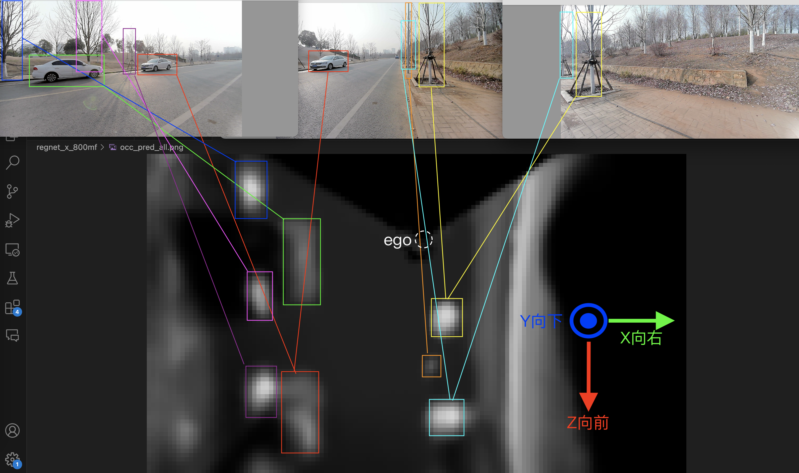

# YOLOXOCC

## 修改记录
### 20250205
1. 纯模型剪枝加速，定频测试为每次55ms
```shell
./xsnnDemo ~/leo/yoloxocc-infer/20250305_yoloxocc_regnet_x_400mf_w16x2x12_v64x4x48_best52.27_images_remapping_rk3588.rknn 
================= Start
sdk version: 2.3.0 (c949ad889d@2024-11-07T11:35:33), dirver version: 0.8.2
============================
Number of input node is: 3
  input 0 name: cameras_image_0, dim is: 1 288 512 3 
  format: NHWC, type: INT8
  input 1 name: cameras_image_1, dim is: 1 288 512 3 
  format: NHWC, type: INT8
  input 2 name: cameras_image_2, dim is: 1 288 512 3 
  format: NHWC, type: INT8
Number of output node is: 1
  output 0 name: occ_pred, dim is: 1 4 48 64 
  format: NCHW, type: INT8
============================
time: 57.2609
time: 54.9214
time: 55.1892
time: 55.1877
time: 55.1268
time: 55.2233
time: 54.9835
time: 55.1087
time: 55.111
time: 55.1276
time: 55.1139
time: 55.1375
time: 55.104
time: 55.0842
time: 55.1991
time: 55.0559
time: 55.2242
time: 55.1699
```

### 20250124
1. 摄像头平面坐标系，垂直底面方向的分辨率由4格*1米改为4格*0.5米，即每格对应0.5米
   * layer0>摄像头上方0.5米（地面上1.5米），layer1为摄像头平面（地面上1米左右），layer2为摄像头下方0.5米（地面上0.5米），layer3<=地面（地面）
2. 提供rk3588专用RKNN模型：
   * 为方便移植，在400m以下的模型上去除了时序模块，同时将输入用三张image替代，即(CAM, 3, C, H, W)--> 3*(1, CAM, C, H, W), 图片顺序为Front-Left-Right
   * 同步提供RKNN模型，输入输出与onnx一致，BGR颜色输入，图像缩放linear方式

### 20241212
1. 由于有多种采集设备，摄像头、雷达与车身无法绑定，所以将车底平面坐标系ego system修改为摄像头平面坐标系，同时
* 原高度方向4格(layer0~layer3)，其中layer2表示是车底平面:
	* * layer0>=地面+1.5米（地面上方2米左右），layer1为地面+[0.5,1.5)米（地面上方1米左右），layer2为地面+[-0.5,0.5)米（地面），layer3<地面-0.5米（地面下1米左右）
	* * 建议将layer2值>=0.5 and layer1值<0.5 的部分当作可行驶区域，即0米有地且1米高度无遮挡
* 修改后高度方向4格(layer0~layer3)，其中layer1表示摄像头所在平面：
	* * layer0>=摄像头+0.5米（摄像头上方1米），layer1为摄像头+[-0.5,0.5)米（摄像头平面），layer2为摄像头+[-1.5,-0.5)米（摄像头下方1米），layer3<摄像头-1.5米（摄像头下方2米）
	* * 摄像头高度约地面上1米，建议将layer2值>=0.5 and layer1值<0.5 的部分当作可行驶区域，即0米有地且1米高度无遮挡
	
2. 新壳体left camera和middle camera交换，重新输出的模型修订了两者的内参
3. 由于Mid360下方有60度锥形盲区，同时摄像头纵向FOV90°，车身正下方有半径1.5/1.732=0.866米的盲区，即车底有半径0.866米的地面无法反馈，暂时认为底面layer2中心半径0.866米内有地面，其它操作不变
   
### 20250112
1. OCC格子统一改为YZX=(4,48,64)，对应实际世界距离高[-1,2]，前8米后4米，左右各8米；Y高度每格1米不变，ZX水平面改为**每格0.25米**，即1像素对应0.25米
2. 提供regnet800mf的中规模和小规模m、s两种模型，输入输出一致，m用于AGX，s后续用于RK3588

## 安装
```shell
pip3 install onnxruntime==1.19.2
pip3 install opencv-python==4.10.0.84
```

## 运行
```
python3 yoloxocc_infer.py --onnx 20250222_yoloxocc_regnet_x_200mf_w16x2x12_v64x4x48_best52.24_images_remapping.onnx --model regnet_x_400mf --test 1 --images
```

## 坐标系



使用ego坐标系，坐标系原点在车辆底部激光雷达的垂直投影点

- Z: forward
- Y: **down**
- X: right

This means the top-left of an image is "0,0", and coordinates increase as you travel right and down. `Z` increases forward because it's the depth axis.

### 注意

   1. 模型输入
      
      1. cameras_image: 按照Front-Left-Right的顺序拼接，(1, CAM, C, H, W)，RGB归一化预处理
      2. 800m以上模型包含temporal_feature_in: 时序输入，每次上电初始输入为(1,672,12,16)大小的全0矩阵，后续输入为上1帧的时序输出

   2. 模型输出

      1. occ_pred (occ[0]): 的shape是(1, 4, 48, 64)，对应(_, Y, X, Z)，上下4格，前后96格，左右128格

       * 4表示是occupancy map的高度:
       * * 层高每格0.5米
       * * 建议将 3层值>=0.35 and 1层值<0.65 的部分当作可行驶区域，即0米高度有地且1米高度无遮挡

       * 48x64是occupancy map的大小:
       * * 48表示ego前后方向，前方32格代表8米，后方16格代表4米，总计[-4,8)共12米
       * * 64表示ego左右方向，左右各32格代表各8米，总计[-8,8)共16米
       * * ZX平面一个像素对应0.25米
       * * 图像左上角是原点，ego前方图像向下，ego右方图像向右
       * * **ego原点在图像X=32,Y=16的位置**

      2. 800m以上模型有temporal_feature_out (occ[1])时序输出：(1,672,6,8)矩阵，作为下1次运行的输入
